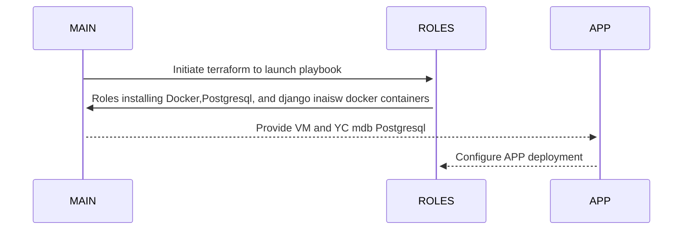

# SkillFactory-B7-Project-Work-Webapp-MAIN

# [Roles are here](https://github.com/Morshimus/SkillFactory-B7-Project-Work-Webapp-Roles)

# [App is here](https://github.com/Morshimus/SkillFactory-B7-Project-Work-Webapp-APP)

## Задание 

* [x] - :one: ~~**Создать ВМ в Я.Облаке (минимальная конфигурация: 2vCPU, 2GB RAM, 20GB HDD).**~~
* [x] - :two: ~~**Установить и запустить на ВМ Docker.**~~
* [x] - :three: ~~**Установить и запустить на ВМ СУБД Postgres.**~~
* [x] - :four: ~~**В Postgres создать БД и пользователя с произвольным именем на ваш выбор и дать этому пользователю полные права на созданную БД.**~~
* [x] - :five: ~~**Создать Docker-образ:**~~
   - ~~*Содержащий Python 3, а также библиотеки для него: Flask, Psycopg2 (для работы с СУБД Postgres, хранящей данные) и ConfigParser.*~~
   - ~~*Содержащий код приложения на Python (копирующий его с локальной файловой системы). На хостовой ФС код будет лежать по пути: /srv/app/web.py.*~~
   - ~~*Содержащий конфигурационный файл приложения (копирующий его с локальной ФС). На хостовой ФС конфигурационный файл будет лежать по пути: /srv/app/conf/web.conf.*~~
   - ~~*Содержащий конфигурационный файл приложения (копирующий его с локальной ФС). На хостовой ФС конфигурационный файл будет лежать по пути: /srv/app/conf/web.conf.*~~
   - ~~*При запуске контейнера, он должен запускать описанный выше код.*~~
   - ~~*Образ должен быть оптимизирован с учетом лучших практик.*~~
   
# Start
 
 > Для того чтобы разобраться в нашем проекте понадобиться некая схема, как мы свяжем 3 разных репозитория в единую конструкцию.
 > При планировании было решено развернуть 2 среды приложения - тестовая и продакшн, где тестовая это локально настроеный экземпляр PostgreSQL а продакшн это Yandex Cloud mdb Postgresql Cluster. Контейнеры приложения будут разворачиваться на одной вм. Volumes буду файлы django - static, template, + django.conf.

$${\color{pink}Here \space We \space Go \space Again }$$


 
# Напишем наш джанго view -  будет показывать какой экземпляр бд запущен на веб страницу. Данные берутся из перемнной подключения БД.

$${\color{magenta}views.py|APP}$$

```
from django.http import HttpResponse
from django.template import loader
from configparser import ConfigParser
from configparser import NoSectionError as configparse_err

def get_db_config(db_option):
 config = ConfigParser()

 config.read('/app/django.conf')
 try:
     result = config.get("database", db_option)
 except configparse_err:
    print ('Cannot get {}. There is no such section or config file is unavailable/does not exist').format(db_option)
    exit ()
 return result

def index(request):
    template = loader.get_template('polls/index.html')
    db_name = "database {0}".format(get_db_config("db_name"))
    context = {
        'db_name': db_name,
    }
    return HttpResponse(template.render(context, request))
```
 
# Template html помещен в роли, так как представляет собой однотипный шаблон.

$${\color{magenta}index.html|Roles|django|files}$$

```

<link rel="stylesheet" href="">
<link rel="shortcut icon" type="image/png" href=""/>
<h1>You are at {{ db_name }}</h1>

```

# Собираем нащ Dockerfile, и можем приступать. *(Все роли были проверены на молекуле,да да, даже сервисы)*

$${\color{magenta}Dockerfile|APP}$$

```
FROM  python:3.9.2-alpine AS builder
ENV PYTHONUNBUFFERED 1
EXPOSE 8000
WORKDIR /app 
COPY requirements.txt /app
RUN apk -U upgrade && \
    apk --no-cache add gcc  \
    musl-dev \
    postgresql-dev \
    python3-dev && \
    pip3 install --upgrade pip &&\ 
    pip3 install -r requirements.txt --no-cache-dir
ADD SkillFactory/. /app
ENTRYPOINT ["python3"] 
CMD ["manage.py", "runserver", "0.0.0.0:8000"]
```

> Далее отправляем наш докер образ на докер хаб, пометив версию, и добавив тег latest. В данной конфигурации берем latest на удаленной ВМ


$${\color{magenta}dockerbuild.ps1|APP}$$

```
docker build -t morsh92/skillfactory-web-pg:$args -t morsh92/skillfactory-web-pg:latest .;
if($?){
docker push morsh92/skillfactory-web-pg:$args;
docker push morsh92/skillfactory-web-pg:latest;     
}
```

> И настоет время поднять этого гиганта. В данной версии также внедрены теги  для энсибль под прод и тест, которыми в дальнейшем можно удобно жонглировать

$${\color{magenta}provisioning.yml|MAIN}$$

```
- hosts: app
  gather_facts: yes
  tags: "test"
  become: yes   
  tasks:  
   - name: Create Django Test App container
     include_role:
        name: common/django
     vars:
          pg_fqdn: "172.17.0.1"
          pg_port: "5432"
          pg_db_user: "django"
          pg_db_user_password: "{{ pg_db_user_password }}"
          pg_db_name: "django_test"
          django_app_root: /srv/app/tst
          django_app_static: /srv/app/tst/static/polls
          django_app_templates: /srv/app/tst/templates/polls
          container_name : "sf_web_tst"
          container_port: "8001"
          is_local: true


- hosts: app
  gather_facts: yes
  tags: "production"
  become: yes   
  tasks:
   - name: Create Django Prod App container
     include_role:
         name: common/django
     vars:
          pg_fqdn: "{{ db_fqdn }}"
          pg_port: "6432"
          pg_db_user: "{{ db_user }}"
          pg_db_user_password: "{{ pg_db_user_password }}"
          pg_db_name: "{{ db_name }}"
          django_app_root: /srv/app/prd
          django_app_static: /srv/app/prd/static/polls
          django_app_templates: /srv/app/prd/templates/polls
          container_name : "sf_web_prd"
          container_port: "8000"
          is_local: false
```

> Пользуемся динамической инвентори.

$${\color{yellow}templates|ansibleinventorytemplate.tpl:}$$

```
[app]
${hostname} ansible_host=${ip} ansible_user=${user}
[app:vars]
db_name=${db_name}
db_user=${db_user}
db_fqdn=${db_fqdn}
pg_version=${pg_version}
pg_data_root=${pg_data_root}
```
 
# Поехали!


<!-- BEGINNING OF PRE-COMMIT-TERRAFORM DOCS HOOK -->
## Requirements

| Name | Version |
|------|---------|
| <a name="requirement_terraform"></a> [terraform](#requirement\_terraform) | >= 1.3.5 |
| <a name="requirement_ansiblevault"></a> [ansiblevault](#requirement\_ansiblevault) | = 2.2.0 |
| <a name="requirement_local"></a> [local](#requirement\_local) | >= 2.3.0 |
| <a name="requirement_yandex"></a> [yandex](#requirement\_yandex) | ~> 0.84.0 |

## Providers

| Name | Version |
|------|---------|
| <a name="provider_ansiblevault"></a> [ansiblevault](#provider\_ansiblevault) | 2.2.0 |
| <a name="provider_local"></a> [local](#provider\_local) | 2.3.0 |
| <a name="provider_yandex"></a> [yandex](#provider\_yandex) | 0.84.0 |

## Modules

| Name | Source | Version |
|------|--------|---------|
| <a name="module_morsh_instance_ya_1"></a> [morsh\_instance\_ya\_1](#module\_morsh\_instance\_ya\_1) | ./INSTANCE | n/a |
| <a name="module_morsh_pg_cluster_db_ya_1"></a> [morsh\_pg\_cluster\_db\_ya\_1](#module\_morsh\_pg\_cluster\_db\_ya\_1) | ./MDB_POSTGRESQL_DATABASE | n/a |
| <a name="module_morsh_pg_cluster_user_ya_1"></a> [morsh\_pg\_cluster\_user\_ya\_1](#module\_morsh\_pg\_cluster\_user\_ya\_1) | ./MDB_POSTGRESQL_DATABASE_USER | n/a |
| <a name="module_morsh_pg_cluster_ya_1"></a> [morsh\_pg\_cluster\_ya\_1](#module\_morsh\_pg\_cluster\_ya\_1) | ./MDB_POSTGRESQL_CLUSTER | n/a |
| <a name="module_morsh_sec_group_ya_1"></a> [morsh\_sec\_group\_ya\_1](#module\_morsh\_sec\_group\_ya\_1) | ./SEC_GROUP | n/a |

## Resources

| Name | Type |
|------|------|
| [local_file.yc_inventory](https://registry.terraform.io/providers/hashicorp/local/latest/docs/resources/file) | resource |
| [yandex_vpc_network.morsh-network](https://registry.terraform.io/providers/yandex-cloud/yandex/latest/docs/resources/vpc_network) | resource |
| [yandex_vpc_subnet.morsh-subnet-a](https://registry.terraform.io/providers/yandex-cloud/yandex/latest/docs/resources/vpc_subnet) | resource |
| [ansiblevault_path.db_key](https://registry.terraform.io/providers/MeilleursAgents/ansiblevault/2.2.0/docs/data-sources/path) | data source |

## Inputs

| Name | Description | Type | Default | Required |
|------|-------------|------|---------|:--------:|
| <a name="input_cloud_id_yandex"></a> [cloud\_id\_yandex](#input\_cloud\_id\_yandex) | Cloud id of yandex.cloud provider | `string` | n/a | yes |
| <a name="input_folder_id_yandex"></a> [folder\_id\_yandex](#input\_folder\_id\_yandex) | Folder id of yandex.cloud provider | `string` | n/a | yes |
| <a name="input_network_name_yandex"></a> [network\_name\_yandex](#input\_network\_name\_yandex) | Created netowork in yandex.cloud name | `string` | n/a | yes |
| <a name="input_os_disk_size"></a> [os\_disk\_size](#input\_os\_disk\_size) | Size of required vm | `string` | `"20"` | no |
| <a name="input_pg_data_root"></a> [pg\_data\_root](#input\_pg\_data\_root) | Path to pg\_data root folder at APP servers. | `string` | `"/opt/pg_data"` | no |
| <a name="input_pg_version"></a> [pg\_version](#input\_pg\_version) | Version of the PostgreSQL cluster. <br>  (allowed versions are: 10, 10-1c, 11, 11-1c, 12, 12-1c, 13, 13-1c, 14, 14-1c,**15**) | `number` | `15` | no |
| <a name="input_service_account_key_yandex"></a> [service\_account\_key\_yandex](#input\_service\_account\_key\_yandex) | Local storing service key. Not in git tracking | `string` | `"./key.json"` | no |
| <a name="input_source_image"></a> [source\_image](#input\_source\_image) | OS family of image | `string` | `"ubuntu-2004-lts"` | no |
| <a name="input_subnet_a_description_yandex"></a> [subnet\_a\_description\_yandex](#input\_subnet\_a\_description\_yandex) | n/a | `string` | `"Subnet A for morshimus instance A"` | no |
| <a name="input_subnet_a_name_yandex"></a> [subnet\_a\_name\_yandex](#input\_subnet\_a\_name\_yandex) | Subnet for 1st instance | `string` | `"morsh-subnet-a"` | no |
| <a name="input_subnet_a_v4_cidr_blocks_yandex"></a> [subnet\_a\_v4\_cidr\_blocks\_yandex](#input\_subnet\_a\_v4\_cidr\_blocks\_yandex) | IPv4 network for 1st instance subnet | `list(string)` | <pre>[<br>  "192.168.21.0/28"<br>]</pre> | no |
| <a name="input_useros"></a> [useros](#input\_useros) | OS native default user | `string` | `"ubuntu"` | no |
| <a name="input_zone_yandex_a"></a> [zone\_yandex\_a](#input\_zone\_yandex\_a) | Zone of 1st instance in yandex cloud | `string` | `"ru-central1-a"` | no |

## Outputs

| Name | Description |
|------|-------------|
| <a name="output_db_user_password"></a> [db\_user\_password](#output\_db\_user\_password) | n/a |
| <a name="output_external_ip_address_vm_1"></a> [external\_ip\_address\_vm\_1](#output\_external\_ip\_address\_vm\_1) | n/a |
| <a name="output_hostname_vm_1"></a> [hostname\_vm\_1](#output\_hostname\_vm\_1) | n/a |
| <a name="output_internal_ip_address_vm_1"></a> [internal\_ip\_address\_vm\_1](#output\_internal\_ip\_address\_vm\_1) | n/a |
| <a name="output_morsh_pg_cluster_db_ya_1_id"></a> [morsh\_pg\_cluster\_db\_ya\_1\_id](#output\_morsh\_pg\_cluster\_db\_ya\_1\_id) | n/a |
| <a name="output_morsh_pg_cluster_db_ya_1_name"></a> [morsh\_pg\_cluster\_db\_ya\_1\_name](#output\_morsh\_pg\_cluster\_db\_ya\_1\_name) | n/a |
| <a name="output_morsh_pg_cluster_user_ya_1_id"></a> [morsh\_pg\_cluster\_user\_ya\_1\_id](#output\_morsh\_pg\_cluster\_user\_ya\_1\_id) | n/a |
| <a name="output_morsh_pg_cluster_user_ya_1_name"></a> [morsh\_pg\_cluster\_user\_ya\_1\_name](#output\_morsh\_pg\_cluster\_user\_ya\_1\_name) | n/a |
| <a name="output_morsh_pg_cluster_ya_1_host_fqdn"></a> [morsh\_pg\_cluster\_ya\_1\_host\_fqdn](#output\_morsh\_pg\_cluster\_ya\_1\_host\_fqdn) | n/a |
| <a name="output_morsh_pg_cluster_ya_1_id"></a> [morsh\_pg\_cluster\_ya\_1\_id](#output\_morsh\_pg\_cluster\_ya\_1\_id) | n/a |
<!-- END OF PRE-COMMIT-TERRAFORM DOCS HOOK -->
